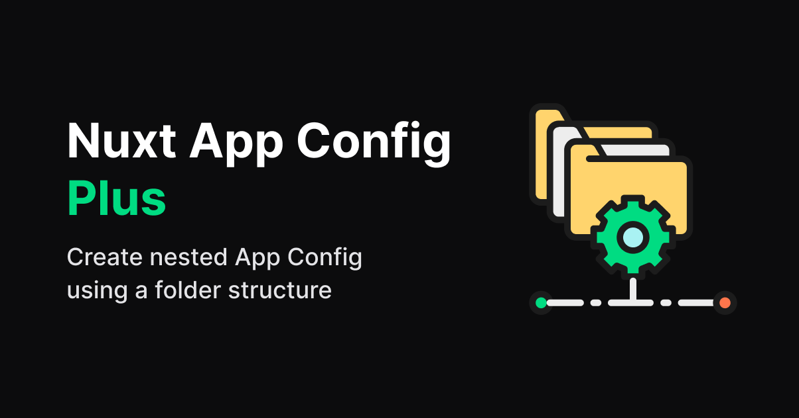
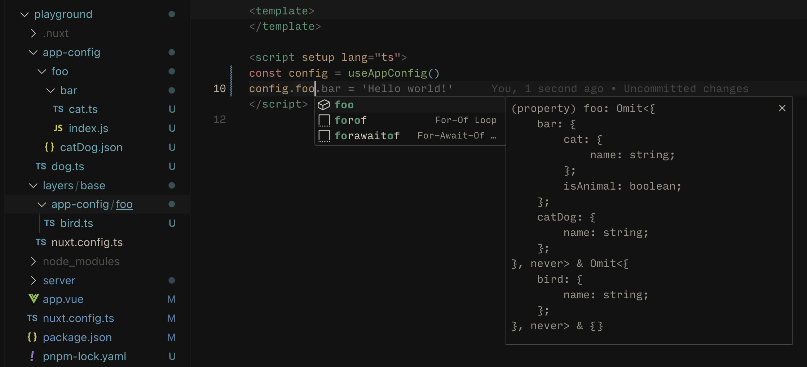

<!--
Get your module up and running quickly.

Find and replace all on all files (CMD+SHIFT+F):
- Name: My Module
- Package name: my-module
- Description: My new Nuxt module
-->
[](https://nuxt-open-fetch.vercel.app/)

# Nuxt App Config Plus

[![npm version][npm-version-src]][npm-version-href]
[![npm downloads][npm-downloads-src]][npm-downloads-href]
[![License][license-src]][license-href]
[![Nuxt][nuxt-src]][nuxt-href]

Create nested App Config using a folder structure

- [✨ &nbsp;Release Notes](/CHANGELOG.md)
<!-- - [🏀 Online playground](https://stackblitz.com/github/your-org/nuxt-configs?file=playground%2Fapp.vue) -->
<!-- - [📖 &nbsp;Documentation](https://example.com) -->

## Features

<!-- Highlight some of the features your module provide here -->
- 🗂 &nbsp;Generate App Config using a folder structure
- 🍹 &nbsp;No need for redundant index files and re-exports
- 📃 &nbsp;Supports `js`, `ts` and `json` files
- 🥞 &nbsp;Supports Nuxt layers



## Quick Setup

Install the module to your Nuxt application with one command:

```bash
npx nuxi module add nuxt-app-config-plus
```

That's it! You can now use Nuxt App Config Plus in your Nuxt app ✨

## Overview
The `nuxt-app-config-plus` module allows you to generate App Config  based on a specified folder structure. It supports `js`, `ts`, and `json` files and is compatible with Nuxt layers.

### Configs for Nitro handlers

In some cases, you may want certain configurations to be available only for the server hanlders (Nitro) and not included in the client-side bundle. This can be useful for configurations that are only relevant to the server environment.

#### Usage
To mark a config as server-side only, simply put it under `server` folder. The module will then only include this configuration to the Nitro App Config:
```bash
/app-config
  /server
    bar.ts
```

In this example, the `bar.ts` file inside the `server` folder will only be included in the server-side Nitro config.

## Options
### `dir`
The dir option allows you to specify the directory that the module should scan for configuration files. By default, the module scans the `/app-config` directory in the root of your project.

### `case`
By default, module uses the folder names as keys in the App Config object exactly as they are. This means that the keys are case-sensitive. For example, a folder named `MyFolder` would result in a key `MyFolder` in the configuration object.

You can change this default behavior by setting `case` to `camelCase` or `kebabCase`, so the module will convert all folder names to camel case or kebab case respectively.


## Contribution

<details>
  <summary>Local development</summary>
  
  ```bash
  # Install dependencies
  pnpm install
  
  # Generate type stubs
  pnpm dev:prepare
  
  # Develop with the playground
  pnpm dev
  
  # Build the playground
  pnpm dev:build
  
  # Run ESLint
  pnpm lint
  
  # Run Vitest
  pnpm test
  pnpm test:watch
  
  # Release new version
  pnpm release
  ```

</details>

## License

Made with 💚

Published under the [MIT License](./LICENCE).


<!-- Badges -->
[npm-version-src]: https://img.shields.io/npm/v/nuxt-app-config-plus/latest.svg?style=flat&colorA=020420&colorB=00DC82
[npm-version-href]: https://npmjs.com/package/nuxt-app-config-plus

[npm-downloads-src]: https://img.shields.io/npm/dm/nuxt-app-config-plus.svg?style=flat&colorA=020420&colorB=00DC82
[npm-downloads-href]: https://npmjs.com/package/nuxt-app-config-plus

[license-src]: https://img.shields.io/npm/l/nuxt-app-config-plus.svg?style=flat&colorA=020420&colorB=00DC82
[license-href]: https://npmjs.com/package/nuxt-app-config-plus

[nuxt-src]: https://img.shields.io/badge/Nuxt-020420?logo=nuxt.js
[nuxt-href]: https://nuxt.com
